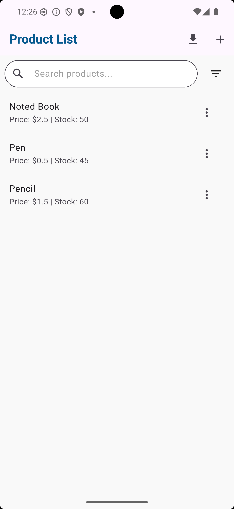
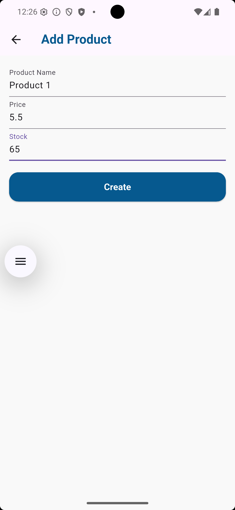
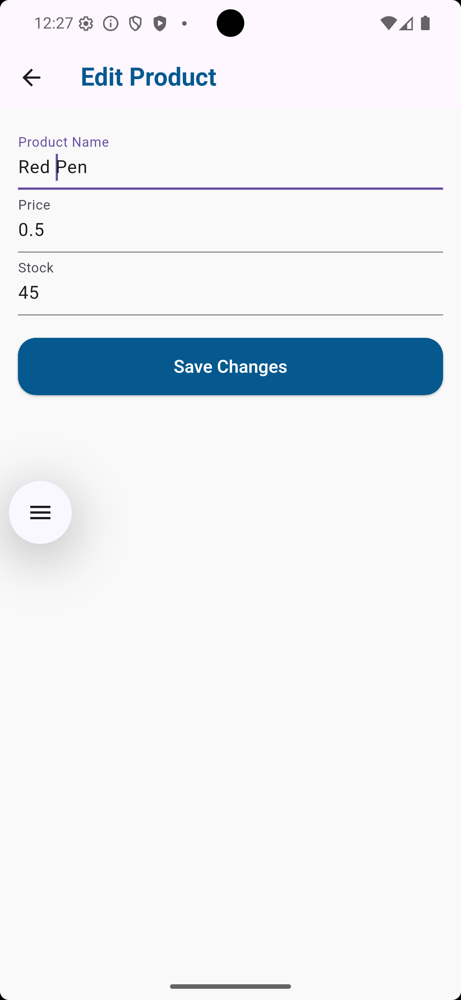

# 🛒 Flutter Product CRUD App

A simple Flutter application for managing a list of products with full CRUD (Create, Read, Update, Delete) functionality using **Provider**, **REST API integration**, and **PDF export** support.

---

## 🚀 Features

- ✅ List all products with price and stock
- 🔍 Search bar with debounce
- 🧠 Sort/filter dropdown
- ✏️ Add, edit, and delete products
- 📄 Export product list to PDF
- 🌐 RESTful API integration
- 🎨 Modern UI with reusable components
- 💡 State management using `Provider`

---

## 📸 Screenshots

| Product List                          | Add Product                         | Edit & Delete                         |
| ------------------------------------- | ----------------------------------- | ------------------------------------- |
|  |  |  |

---

## 🛠️ Tech Stack

- **Flutter**
- **Provider** (state management)
- **HTTP** (API calls)
- **Path Provider** (PDF export path)
- **Permission Handler** (storage permissions)
- **PDF** (generate export file)

---

## 📦 Installation

```bash
git clone https://github.com/lymakara-dev/product-crud-flutter.git
cd product-crud-flutter
cp .env.example .env
flutter pub get
flutter run
```
